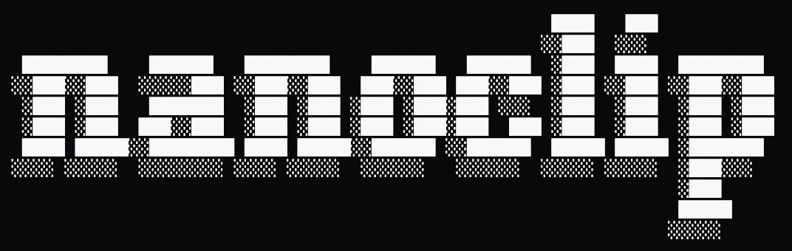
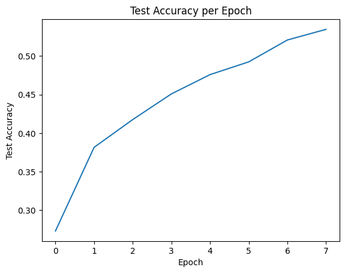
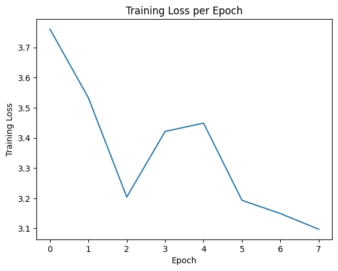

## 🚫 Vibe Coding Disclaimer

**Disclaimer**  
This repository was **not** created using “vibe coding.”

# nanoclip

`nanoclip` is a minimalist, nano-scale implementation of the Contrastive Language-Image Pre-training (CLIP) model, built using PyTorch. This project aims to provide a clear and concise example of how to implement a dual-encoder model that learns to embed images and text into a shared, multimodal latent space.

## Features:
- **Vision Encoder:** A lightweight Vision Transformer (ViT) for processing image inputs.
- **Text Encoder:** A compact Transformer model for encoding text inputs.
- **Contrastive Learning:** Implements the core CLIP training objective to align image and text embeddings.
- **Configurable:** Parameters for both vision and text models are easily adjustable via `config.py`.

Currently the project is in development, only one toy training run has been done on a remote 1xRTX 3600 on CIFAR10. More to come..

## Training Plots:

